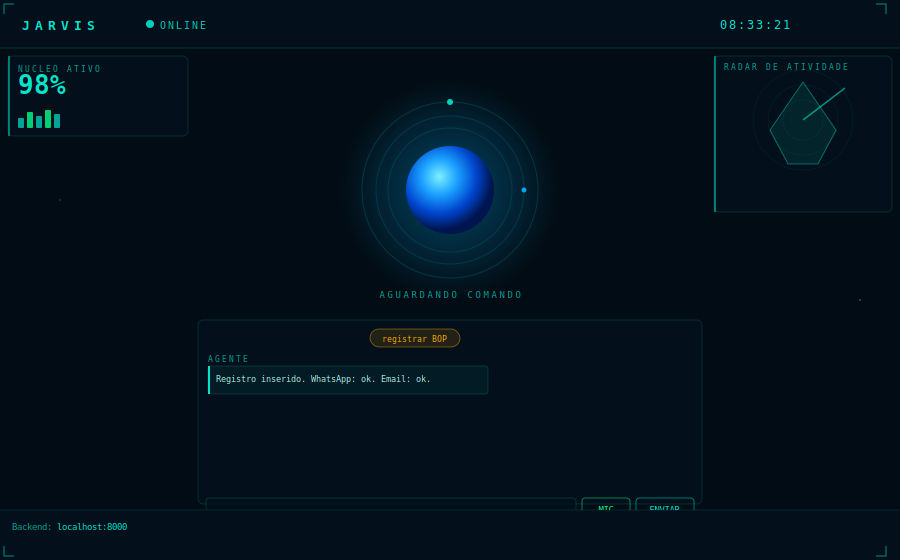

# Agente BOP Inteligente



Assistente de voz com IA para registro automático de ocorrências elétricas (BOP) em subestações e parques eólicos.

## Funcionalidades

- Interface web sci-fi com orbe animado
- Reconhecimento de voz contínuo em português
- IA conversacional (OpenAI GPT, Claude, Ollama)
- Síntese de voz via OpenAI TTS
- Registro automático em Google Sheets via relato livre por voz
- Notificação automática via WhatsApp (Evolution API)
- Alerta por email com layout HTML profissional

## Stack

- **Backend:** Python 3 + FastAPI
- **Frontend:** HTML/CSS/JS puro
- **IA:** OpenAI GPT-4o / Claude / Ollama
- **Planilha:** Google Sheets API (gspread)
- **WhatsApp:** Evolution API
- **Email:** SMTP Gmail

## Instalação

```bash
pip install -r requirements.txt
```

## Configuração

Copie o `.env.example` para `.env` e preencha as variáveis:

```bash
cp .env.example .env
```

Adicione o `credentials.json` da conta de serviço Google na pasta raiz.

## Execução

```bash
python -m uvicorn main:app --host 0.0.0.0 --port 8000
```

Acesse: `http://localhost:8000`

## Uso do BOP

1. Clique em **registrar BOP**
2. Fale livremente o ocorrido
3. O agente extrai as informações automaticamente
4. Confirme o registro
5. Planilha, WhatsApp e email são atualizados automaticamente
